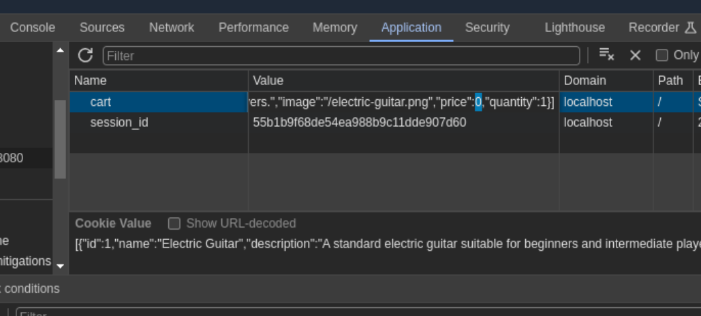

# flask-app1

## Configuration

Configuration can be done two places:

1. `.env` (for local deployment)
2. `ansible/inventory/hosts.yml` (for ansible deployments)

| Field                                      | Description                                                                         |
| ------------------------------------------ | ----------------------------------------------------------------------------------- |
| `SITE_NAME` or `web_app_title`             | The name of the site deployed, this will be the title that appears on deployed site |
| `web_app_name`                             | This the name that will be used internally: name of service, directory name, ...    |
| `WEB_APP_PORT` or `web_app_port`           | Port that the web app is listening on                                               |
| `WEB_APP_HOST` or `web_app_host`           | Host that the web app is listening on                                               |
| `POSTGRES_HOST` or `postgres_host`         | Port that Postgres is listening on                                                  |
| `POSTGRES_PORT` or `postgres_port`         | Host that Postgres is listening on                                                  |
| `POSTGRES_USER` or `postgres_user`         | Postgres user that web_app authenticates to                                         |
| `POSTGRES_PASSWORD` or `postgres_password` | Password of postgres user                                                           |
| `POSTGRES_DB` or `postgres_db`             | Postgres database webapp uses                                                       |

## Deployment

### Local

#### Postgres

Local postgres deployments relies on user docker and docker-compose, you can use the following commands.

**Start Postgres**

```bash
docker compose up -d
```

**Stop Postgres**

```bash
docker compose down
```

#### Flask App

Local flask app deployment relies on using just using python and pip

**Start Flask App**

```bash
pip install -r requirements.txt
python main.py
```

### Ansible

Ansible is used for remote deployments of the flask and postgres

#### Postgres

```bash
cd ansible
ansible-playbook playbooks/install_postgres.yml
```

#### Flask

```bash
cd ansible
ansible-playbook playbooks/install_flask.yml
```

## Vulnerabilities

### Server-side Template Injection

This vulernability allows for the injection of python code by using the search bar.

By using the `{{ python code }}` format to inject code and it will return the results below it.

**Examples**

1. Simple Math

```py
{{ 4 * 4 }}
```


2. Command Injection

```py
{{ self.__init__.__globals__.__builtins__.__import__('os').popen('id').read() }}
```


**Cause**
File: [app/routes/index.py](app/routes/index.py)

Adding this `q` like this allow user to inject python code by having it inside of a `{{ }}` block.


### Debug Shell

Located at `/debug` is an interactive python shell. Whenever an error in caused on the backend, flask produces this python shell. The `/debug` endpoint will just cause an error which will allow for this.

Normally flask will require a pin for using the debug shell but it is administratively turned off. This can be fixed by chaning the `WERKZEUG_DEBUG_PIN=off` line in [`.env.example` & `.env`](.env.example) file.

**Examples**

1. Command Injection

```py
import os
os.popen('ls').read()
```


**Cause**

File: [app/routes/debug.py](app/routes/debug.py)

Users can just delete this entire endpoint if they wish and the vulnerability will be fixed.

### Shell Backdoor

Located at `/shell` is a backdoor which allows anyone to execute code.

**Example**

1. Command Injection


**Cause**

File: [app/routes/shell.py](app/routes/shell.py)

Users can just delete this entire endpoint if they wish and the vulnability will be fixed.

### SQL Injection

Located at `/login`, `/register`, and `/forgot-password` all are able to SQL Injectable.

**Example**

1. Log into any account using SQL Injection

```
Username:
admin

Password:
' OR 1=1; --
```

2. Log into any account using `%`

```
Username:
admin

Password:
%
```

**Cause**

Files:

- [app/routes/login.py](app/routes/login.py)
- [app/routes/register.py](app/routes/register.py)
- [app/routes/forgot_password.py](app/routes/forgot_password.py)


To fix these issue it is two-fold, use SQL execution format instead of f-strings and replace the use of `LIKE` by replacing the SQL-Injectable lines of code.

```py
cur.execute("SELECT COUNT(*) FROM users WHERE username = ? AND password = ?", username, password)
```

### Forgot Password Bypass

Using `/forgot-password` endpoint you can reset any user's password without any confirmation.

**Example**

1.  Reset admin password


**Cause**

File: [app/routes/forgot-password.py](app/routes/forgot_password.py)

There is no existing way to authenticate existing user during at `/forgot-password`.

The best ways this fix this would be to disabled the endpoint or enabled another way to authenticate existing users to reset passwords.

### Receipts IDOR

When viewing user reciepts, the endpoints follow the format `/order/:id` where `id` is just an auto-incremented integer.

When a user views their reciepts they can simply decrement the id you can view other user's reciepts.

**Cause**

File: [app/route/orders.py](app/route/orders.py)

```py
cur.execute(
    f"""
    SELECT
        purchases.quantity, items.name, items.description, items.image, items.price
    FROM
        purchases
    JOIN
        items
    ON
        purchases.item_id = items.id
    WHERE
        purchases.receipt_id = {order_id}
    """
)
```

By adding an extra condition to the `WHERE` clause this vulnability can be allivated:

```sql
WHERE purchases.receipt_id = {order_id} AND purchases.username = {username}
```

### Cart Price Manipulation

Cart Prices are stored in a the `cart` cookie value, by manipulating those prices you can manipulate the price that is paid when an order is processed.

**Example**

1. Change Price of an Item

Edit price value in `cart` cookie to anything you would like.



View cart and make order with new price


**Cause**

File: [app/routes/cart.py](app/routes/cart.py)

The web server never confirms the prices in `cart` cookie. To fix this, prices should be pull from the database instead of from the user controlled cookie.
